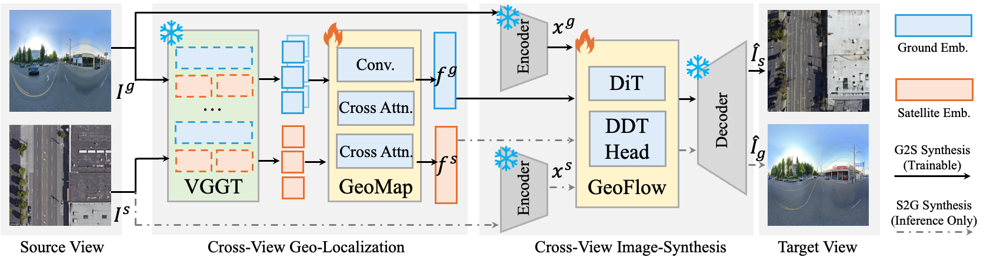

<div align="center">
<h1>Geo²: Geometry-Guided Cross-view Geo-Localization and Image Synthesis </h1>

<a href="https://arxiv.org/abs/2603.25819"></a>
<a href="https://geo2-cvgl.github.io/"></a>

<p>
  <a href="https://yanchengzhang.com/">Yancheng Zhang</a><sup>1</sup>,
  <a href="https://zxh009123.github.io/">Xiaohan Zhang</a><sup>2</sup>,
  <a href="https://guangyusun.com/">Guangyu Sun</a><sup>1</sup>,
  <a href="https://zonglinl.github.io/">Zonglin Lyu</a><sup>1</sup>,
  <a href="https://www.wshahaigroup.com/">Safwan Wshah</a><sup>2</sup>,
  <a href="https://www.crcv.ucf.edu/chenchen/">Chen Chen</a><sup>1</sup>
</p>

**<sup>1</sup>University of Central Florida**; **<sup>2</sup>University of Vermont**
</div>

```bibtex
@article{zhang2026geo,
  title={Geo$^2$: Geometry-Guided Cross-view Geo-Localization and Image Synthesis},
  author={Zhang, Yancheng and Zhang, Xiaohan and Sun, Guangyu and Lyu, Zonglin and Wshah, Safwan and Chen, Chen},
  journal={arXiv preprint arXiv:2603.25819},
  year={2026}
}
```

## Overview


We present 𝗚𝗲𝗼², a unified framework that leverages geometric priors from Geometric Foundation Models (GFMs) to jointly tackle two key tasks: Cross-View Geo-Localization (CVGL) and bidirectional Cross-View Image Synthesis (CVIS).

---

## Installation

### CVGL
Our Cross-view Geo-Localization module leverages geometric priors from 3D foundation models like VGGT for geo-localization task. We keep the VGGT backbone frozon, and only training a lightweight head. Please follow VGGT to set up the environment.

```
git clone git@github.com:facebookresearch/vggt.git 
cd vggt
pip install -r requirements.txt
```

### CVIS
Our Cross-view Image systhesis module achieves bi-directional image generation from both ground-to-satellite and satellite-to-ground.

```
git clone https://github.com/bytetriper/RAE.git
cd RAE
pip install huggingface_hub
hf download nyu-visionx/RAE-collections \
  --local-dir models 
```

## Model Weights

Coming soon.
